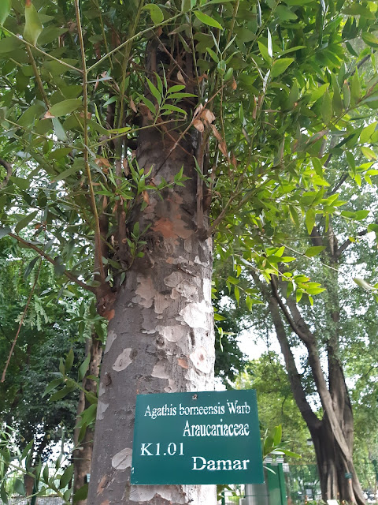

<!DOCTYPE html>
<html lang="en">

<head>
    <meta charset="UTF-8">
    <meta http-equiv="X-UA-Compatible" content="IE=edge">
    <meta name="viewport" content="width=device-width, initial-scale=1.0">
    <link rel="stylesheet" href="../styles.css">
    <link href="https://fonts.googleapis.com/css2?family=Quicksand:wght@300;500;700&display=swap" rel="stylesheet">
    <link rel="stylesheet" href="splide.min.css">
    <title>Document</title>
</head>

<body>
    

        

            

                
            

            

                <a href="#">SMP Amerta</a>
            

        

        

            

                <a href="#">Home</a>
            

            

                <a href="#">Tanaman</a>
            

            

                <a href="#">Tentang</a>
            

        

    

    

        

            

                <h2>Pohon Damar</h2>
            

            

                <a href="#" class="item-nav">
                    
                    
Ciri dan Karakteristik

                </a>
                <a href="#" class="item-nav">
                    
                    
Pemanfaatan Pohon

                </a>
                <a href="#" class="item-nav">
                    
                    
Klasifikasi Ilmiah

                </a>
            

            

                
            

            

                

                    <h3>Ciri dan Karakteristik </h3>
                    
Damar merupakan tumbuhan asli Indonesia. Daerah sebarannya meliputi
                        pulau Sulawesi, kepulauan
                        Maluku, dan kepulauan di Filipina. Namun kini, pohon damar telah dibudidayakan di
                        perkebunan-perkebunan di pulau Jawa. Tumbuh di hutan hujan tropis dataran rendah hingga
                        ketinggian 1.200 meter di atas permukaan laut.

                    
Pohon damar (Agathis dammara) berukuran besar dan tingginya bisa
                        mencapai 65 meter. Batangnya
                        silindris dan lurus dengan diameter mencapai 1,5 meter. Kulit batang berwarna abu-abu muda
                        hingga coklat kemerahan. Kulit mengelupas dalam keping-keping yang tidak beraturan dan biasanya
                        bopeng karena resin.

                    
Daun berbentuk jorong (bulat memanjang) dengan panjang 6 – 8 cm
                        dan lebar 2 – 3 cm. Bagian
                        pangkal daun membaji sedangkan ujungnya runcing. Tulang daun sejajar dan banyak. Bunga jantan
                        dan betina berada pada tandan yang berbeda, pada pohon yang sama (berumah satu).

                    
Meskipun tidak termasuk tanaman langka, namun pohon damar (Agathis
                        dammara) di habitat aslinya
                        telah mengalami populasi hingga 30% dalam 75 tahun terakhir. Oleh karena itu Daftar Merah
                        International Union for Conservation of Nature (IUCN Redlist) memasukkannya dalam spesies
                        Vulnerable (Rentan).

                    

                

                

                    <h3>Pemanfaatan Pohon</h3>
                    
Manfaat utama damar adalah diambil getahnya untuk dioleh menjadi kopal
                        (manila copal). Getah damar keluar dari anavar kulit atau kayu damar yang dilukai. Getah yang
                        keluar akan membeku dan mengeras setelah beberap hari. Getah damar yang mengeras nilah yang
                        kemudian dinamai kopal.

                    
Kopal ini mengandung asam-asam resinol, resin, dan minyak atsiri.
                        Kopal merupakan bahan dasar bagi cairan pelapis kertas supaya tinta tidak menyebar. Selain itu
                        kopal dimanfaatkan untuk campuran lak dan vernis, perekat pada penambal gigi, dan perekat
                        plester.

                    
Pohon damar juga bisa dijadikan pohon penghijauan dan peneduh.
                        Sedangkan kayunya, meskipun kurrang kuat dan awet, kerap diperdagangkan sebagai bahan bangunan
                        dengan nama ‘kayu agatis’.

                    

                

                

                    <h3>Klasifikasi Ilmiah</h3>
                    
Kerajaan : Plantae. Filum : Tracheophyta. Kelas : Pinopsida. Ordo :
                        Pinales. Famili : Araucariaceae. Genus : Agathis.

                     
                    
Spesies : Agathis dammara.

                

            

        

    

    <footer>
        SMP Amerta &copy; 2022
    </footer>

    
    

</body>

</html>