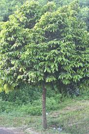

<!DOCTYPE html>
<html lang="en">

<head>
    <meta charset="UTF-8">
    <meta http-equiv="X-UA-Compatible" content="IE=edge">
    <meta name="viewport" content="width=device-width, initial-scale=1.0">
    <link rel="stylesheet" href="styles.css">
    <link href="https://fonts.googleapis.com/css2?family=Quicksand:wght@300;500;700&display=swap" rel="stylesheet">
    <link rel="stylesheet" href="splide.min.css">
    <title>Document</title>
</head>

<body>
    

        

            

                
            

            

                <a href="#">SMP Amerta</a>
            

        

        

            

                <a href="index.html">Home</a>
            

            

                <a href="tanaman.html">Tanaman</a>
            

            

                <a href="tentang.html">Tentang</a>
            

        

    

    

        

            <h2>Glosarium Tanaman</h2>
        

        

            

                

                    <a href="page/damar.html">
                        

                            
                        

                    </a>
                    
Pohon Damar

                

                

                    <a href="page/eboni.html">
                        

                            
                        

                    </a>
                    
Pohon Eboni

                

                

                    <a href="page/pinus.html">
                        

                            
                        

                    </a>
                    
Pohon Pinus

                

                

                    <a href="page/pinus.html">
                        

                            
                        

                    </a>
                    
Pohon Pinus

                

            

        

    

    <footer>
        SMP Amerta &copy; 2022
    </footer>

    
    

</body>

</html>